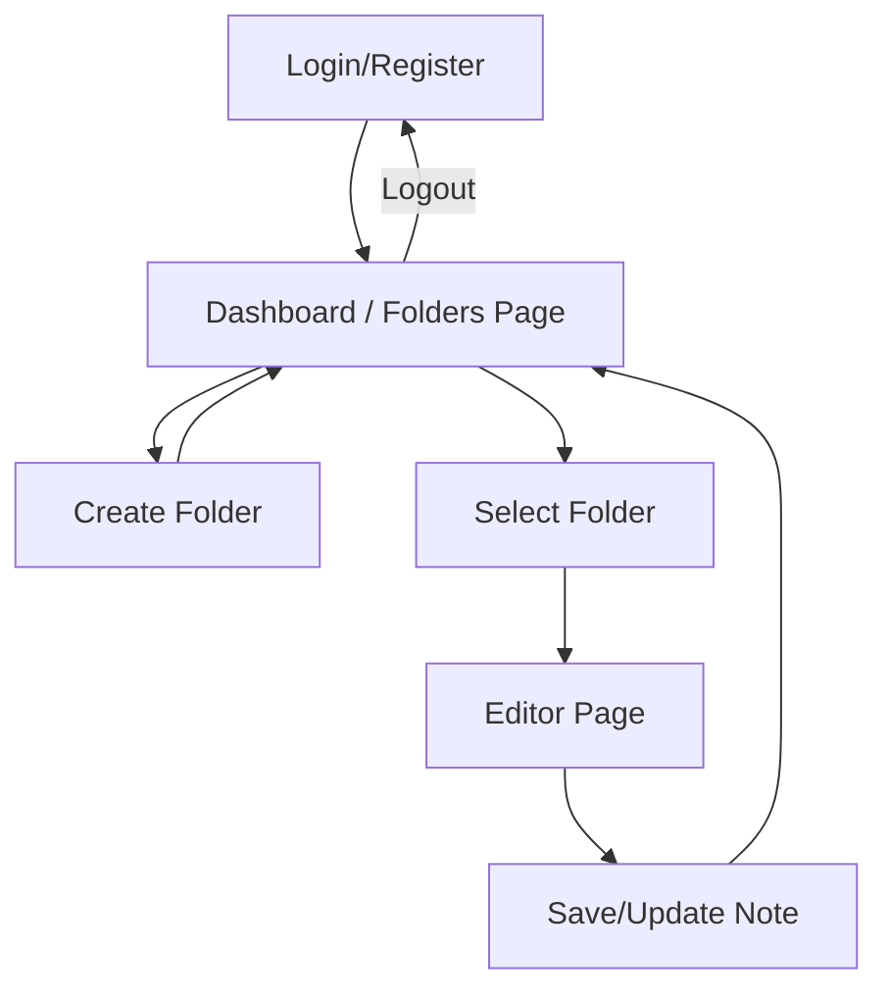

# Notio - React + Vite Note & Folder App

## Overview
Notio is a modern note-taking and folder management web application built with React, Vite, Redux, and GSAP. It features a clean UI, folder creation, note editing with rich formatting, and persistent user data using localStorage and backend API integration.

## Features
- Create, view, and manage folders
- Rich text editor for notes (bold, italic, underline, highlight, etc.)
- Upload and set custom folder images
- User authentication and persistent storage
- Responsive and modern UI with GSAP animations
- State management with Redux
- API integration for user and folder updates

## Tech Stack
- React
- Vite
- Redux & Redux Toolkit
- GSAP (GreenSock Animation Platform)
- React Router
- Axios
- Tailwind CSS (utility classes)
- React Toastify (notifications)


## Project Structure
```
notio/
  public/           # Static assets
  src/
    Assets/         # Images and static resources
    Components/     # Reusable React components (NavBar, Form, etc.)
    Config/         # Axios and config files
    Page/           # Main pages (Folders, EditorPage, Login, Register, etc.)
    Routes/         # App routing logic
    Store/          # Redux store, actions, reducers
      Action/       # Redux actions (UserAction, etc.)
      Reducer/      # Redux reducers (UserReducer, etc.)
  server/           # Mock backend (bd.json, etc.)
```

## Application Flow

1. **User Authentication**: User logs in or registers. User data is stored in localStorage and/or backend.
2. **Folder Management**: User can create, view, and select folders. Each folder can have a title, image, and notes.
3. **Note Editing**: Selecting a folder opens the rich text editor. User can format and save notes.
4. **State Management**: All changes are managed with Redux and synced to localStorage and backend.
5. **Navigation**: React Router handles navigation between pages (Landing, Login, Register, Folders, Editor, etc.).

## Simple App Flow Diagram



## Folder Data Structure Example

```json
{
  "id": "unique-folder-id",
  "tittle": "My Notes",
  "URL": "https://...",
  "description": "<p>Rich text content here</p>"
}
```

## Getting Started
1. **Install dependencies:**
   ```bash
   npm install
   ```
2. **Start the development server:**
   ```bash
   npm run dev
   ```
3. **Run the mock backend (if needed):**
   ```bash
   cd server
   npm install
   npm start
   ```
4. **Open the app:**
   Visit [http://localhost:5173](http://localhost:5173) in your browser.
   
5. ** you can create the json-server and install in it
   npm i json-server
   and create another folder yhe name is file.Json
   example :
       { "id": "vv0eotUAzfXzg2nSJVPxZ",
      "email": "sainiaayush970@gmail.com",
      "password": "123456",
      "folder": [],
   "todolist": [
   {
          "id": 1,
          "task": "Complete the project",
          "description": "FSUFFuffsyxfauh<b>xjysjxsgysvgsygxgsuiy</b> njdcbkbdbciwbc",
          "completed": true
        },
        {
          "id": 2,
          "task": "Attend the meeting",
          "description": "FSUFFuffsyxfauh<b>xjysjxsgysvgsygxgsuiy</b> njdcbkbdbciwbc",
          "completed": true}]
   }
   }

## Usage
- Click "Create Folder" to add a new folder with a title and image URL.
- Click a folder to open the rich text editor and edit notes.
- All changes are saved to localStorage and can be synced with the backend.

## Customization
- Update styles in `src/index.css` or use Tailwind utility classes.
- Modify folder/note logic in `src/Page/Folders.jsx` and `src/Page/EditorPage.jsx`.
- API endpoints and actions are in `src/Store/Action/UserAction.jsx`.

## License
This project is for educational/demo purposes. You can modify and use it as needed.
